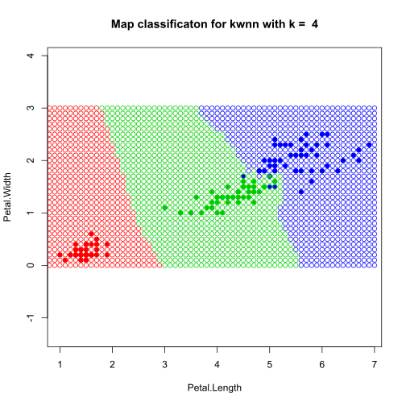

# Системы и методы принятия решений
---
### Оглавление
---

## Метрические алгоритмы классификации
---

### kNN
---
Алгоритм kNN и kWNN - метрические алгоритмы классификации, основаный на оценке сходства объектов. Относит объект к тому классу, элементов которого больше среди k ближайших.

Формула алгоритма kNN (k ближайших соседей) выглядит: ![]

Для выбора оптимального k используем метод скользащего контроля (LOO). Применив kNN и LOO к выборке Ирисы Фишера получим результат:


Видно, что лучишй результат получаем при k = 6, с оценкой ошибки равной 0.33, что равно 96% успешных классификаций.

kNN — один из простейших алгоритмов классификации, поэтому на реальных задачах он зачастую оказывается неэффективным. Помимо точности классификации, проблемой этого классификатора является скорость классификации: если в обучающей выборке N объектов, в тестовой выборе M объектов, а размерность пространства — K, то количество операций для классификации тестовой выборки может быть оценено как O(K\*M\*N).

Карта классификации для kNN:


Код алгоритма kNN:

```r
# Алгоритм kNN
kNN <- function(xl, z, k) {
	orderedXl <- sortObjectsByDist(xl, z)
	n <- dim(orderedXl)[2] - 1
	classes <- orderedXl[1:k, n + 1]
	counts <- table(classes)
	class <- names(which.max(counts))
	return(class)
}
```

Классификация объекта (3,0)


---
Формула алгоритма kWNN (k взвешаных ближайших соседей) выглядит: ![]

Возьмем за вес -.- и переберем по LOO

Видем что лучший результат при k = 6 и q = 1. Равен 0.33, что примерно 96% успешных классификаций. Зачем использовать kwNN если там больше расчетов? В задачах с числом классов 3 и более нечётность уже не помогает и сутации неодназначности могут возниктаь. Тогда на помошь приходят веса, и объект классифицируется к тому классу, чей суммарны вес больше среди k соседий.

Карта классификации для kWNN:




