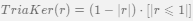

# Системы и методы принятия решений
---

## Метрические алгоритмы классификации

>---
>## kNN
>
>Алгоритм ***kNN*** и ***kWNN*** - метрические алгоритмы классификации, основаный на оценке сходства объектов. Относит объект к тому классу, элементов которого больше среди ***k*** ближайших.
>
>Формула алгоритма **kNN** (*k* ближайших соседей) выглядит: 
>
>Для выбора оптимального k используем метод скользащего контроля (LOO). Применив kNN и LOO к выборке Ирисы Фишера получим результат:
>
>|График LOO(k) | Карта классификации kNN|
>|:------------:|:----------------------:|
>|||
>
>Видно, что лучишй результат получаем при k = 6, с оценкой ошибки равной 0.33.
>
>kNN — один из простейших алгоритмов классификации, поэтому на реальных задачах он зачастую оказывается неэффективным. Помимо точности классификации, проблемой этого классификатора является скорость классификации: если в обучающей выборке N объектов, в тестовой выборе M объектов, а размерность пространства — K, то количество операций для классификации тестовой выборки может быть оценено как O(K\*M\*N).
>
>---
>
>#### Код алгоритма kNN:
>
>```r
># Алгоритм kNN
>kNN <- function(xl, z, k) {
>	orderedXl <- sortObjectsByDist(xl, z)
>	n <- dim(orderedXl)[2] - 1
>	classes <- orderedXl[1:k, n + 1]
>	counts <- table(classes)
>	class <- names(which.max(counts))
>	return(class)
>}
>```
>
>---
>
>#### Классификация объекта (3,0)
>
>
>
>---

>---
>## kWNN
>Формула алгоритма ***kWNN*** (*k* взвешаных ближайших соседей) выглядит: 
>Возьмем за вес  и переберем по LOO
>
>
>**Карта классификации для kWNN:**
>
>|График LOO(k,q) | Карта классификации kWNN|
>|:------------:|:----------------------:|
>|||
>
>Видим что лучший результат при **k = 4**. Равен **0.04**
>
>Зачем использовать ***kwNN*** если там больше расчетов? В задачах с числом классов **3** и более нечётность уже не помогает и сутации неодназначности могут возниктаь. Тогда на помошь приходят веса, и объект классифицируется к тому классу, чей суммарны вес больше среди ***k*** соседий.
>
>---
>
>#### Код алгоритма kNN:
>
>```r
># Алгоритм kNN
>kWNN <- function(xl, z, k) {
>	orderedXl <- sortObjectsByDist(xl, z)
>	n <- dim(orderedXl)[2] - 1
>	weights <- rep(0,3)
>  	names(weights) <- c("setosa", "versicolor", "virginica")
>	classes <- orderedXl[1:k, n + 1]
>	for(i in 1:k) {
>		weights[classes[i]] <- weight(i,k) + weights[classes[i]];
>	}
>	class <- names(which.max(weights))
>	return(class)
>}
>```
>
>---
>
>#### Классификация объекта (3,0)
>
>
>
>---

>---
>## Метод парзеновского окна
>
>**Метод парзеновского окна** — метод классификации, основанный на непараметрическом восстановлении плотности по имеющейся выборке. В основе подхода лежит идея о том, что плотность выше в тех точках, рядом с которыми находится большое количество объектов выборки. В данном алгоритме выбирается следующий способ задать веса соседям: определить , а не от ранга соседа. 
>
>> Введём функцию ядра  - весовую функцию следующим образом:  = , 
>>где ***h***-ширина окна
>> Подберем ***h*** по оценке скользящего контроля LOO
>
> Реализация алгоритма на языке **R**:
>
> 
> ```
>parsen <- function(x, z, h, kerF) {
>    m <- dim(x)[1]
>    n <- dim(x)[2]-1
>    classes <- rep(0, length(names(table(x[,n+1]))))
>    names(classes) <- names(table(x[,n+1]))
>    for(i in 1:m){
>        y <- x[i, n+1]
>        dist <- Distanse(x[i,1:n],z)
>        w <- kerF(dist/h)
>        classes[y] <- classes[y] + w
>    }
>    if(sum(classes) > 0) {
>        class <- names(which.max(classes))
>    } else {
>        class <- "unknown"
>    }
>    return(class)
>}
> ```
> ---
>#### Прямоугольное ядро
>
> Формула: 
>
> Функция ядра на языке **R**:
>
>|``` RectKer <- function(r) (abs(r) <= 1) * 0.5 ```|
>|:-:|
>
> Оптимальная ширина окна ***h = 0.35***, оценка ***LOO = 0.04***
> 
>
>|||
>|:------------------------------:|:------------------------------:|
>
> ---
>#### Треугольное ядро
>
> Формула: 
>
> Функция ядра на языке **R**:
>
>|``` TriaKer <- function(r) (abs(r) <= 1) * (1 - abs(r)) ```|
>|:-:|
>
> Оптимальная ширина окна ***h = 0.35***, оценка ***LOO = 0.04***
> 
>
>|||
>|:------------------------------:|:------------------------------:|
>
> ---
>#### Квартическое  ядро
>
> Формула: 
>
> Функция ядра на языке **R**:
>
>|``` QuarKer <- function(r) (abs(r) <= 1) * (1 - r^2)^2 ```|
>|:-:|
>
> Оптимальная ширина окна ***h = 0.35***, оценка ***LOO = 0.04***
> 
>
>|||
>|:------------------------------:|:------------------------------:|
>
> ---
>#### Ядро Епанечникова
>
> Формула: 
>
> Функция ядра на языке **R**:
>
>|``` EpanKer <- function(r) (abs(r) <= 1) * (1 - r^2) ```|
>|:-:|
>
> Оптимальная ширина окна ***h = 0.35***, оценка ***LOO = 0.04***
> 
>
>|||
>|:------------------------------:|:------------------------------:|
>
> ---
>#### Гауссовское ядро
>
> Формула: 
>
> Функция ядра на языке **R**:
>
>|``` GausKer <- function(r) dnorm(r) ```|
>|:-:|
>
> Оптимальная ширина окна ***h = 0.1***, оценка ***LOO = 0.04***
> 
>
>|||
>|:------------------------------:|:------------------------------:|
>
>---
> **Плюсом** данного метода является хорошее качество классификации объекта при правильно выбраном ***h***, алгоритм прост в реализации и его сложность равна O(N)
> **Минусом** является малый набор настраиваемх параметров, что характеризуется не гибкостью алгоритма. Параметры ширины тебуется подбирать под конкретную обучающую выборку и хранить эту выборку целиком. Так же для всех ядер есть вероятность, что объект не будет классифицирован, так как не попадет в окно. Исключением является Гауссовское ядро.
>
>---

>---
> ## Метод потенциальных функций
>
> Для оценки близости объекта ***u*** к классу y алгоритм использует функцию:
>
> В реализуемом методе используется фиксированная ширина окна. Для первых **50** объектов ***(class=setosa) h=1***, так как объекты данного класса достаточно удалены от объектов других. Для остальных объектов ***h=100***.
> Изачально потенциалы заполняются нулями. Далее, пока количество ошибок классификации не достигнет нужного предела, выбираем случайно точку ***x*** из выборки. Если для нее классификация выполняется неверно, увеличиваем потенциал на **1** и пересчитываем общее количество ошибок.
>
> Объекты, потенциалы которых являются ***ненулевыми*** помечены , объекты, на которых алгоритм ***ошибается*** . Радиус круга - сила потенциала.
>
>|||
>|:------------------------------:|:---------------------------------:|
>
> **Плюсом** данного метода является богатый набор из 2l параметров, с помощью которых можно настроить алгоритм для классификации с высокой точностью.
>**Минусом** является сложность реализации, а также долгий процесс подбора параметров.
>Как итог мы можем классифицировать объекты с максимальной возможной точностью, которую мы можем задать вручную при подборе параметров.
>
>---